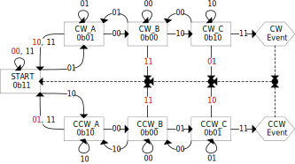
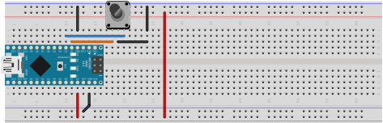

# QDEC

A state-machine based quadrature decoder, licensed under the MIT license.
Support is provided for both full-step (event only after four transitions in the same direction)
and half-step (event only after two transitions in the same direction).

Half-step is more aligned with many existing hardware QDEC peripherals,
and some other libraries.

For rotary encoders with detents that go through a full four-state
transition for each detent, full-step is likely preferable, as only
one event will be generated for each "step" of the knob.

## State Diagrams
The starting point for understanding how this library works is the
different state diagrams.  There are two distinct state diagrams,
one each for half-step and full-step configurations.  Each diagram
shows states as boxes, with exiting transition lines based on the
two new binary values read from the two pins.

#### Invalid state transitions
Each state includes one invalid state transition.  The diagrams
show these using dark-red numbers (the only color in the diagram).
By having these invalid state transitions go to a starting state
(`Start` and `Mid`), spurious events are avoided without complex code.

#### No Debouncing?
Simple Hack! Because two (or four) state transitions in the same
direction must occur prior to an event being reported, bouncing
of a single pin will simply cause transitions between intermediate
states, and will not cause an event.
For example, if state is bouncing between `0b10` and `0b11`, at
most one event will be generated, and only where the initial state
was either `CW C`, or where the initial state was `CCW A`
(but only in half-step mode).

#### Half-step

#### Full-step

## Conversion to code
The state diagrams can be directly converted into a state transition
table. The entire state transition table (including event indication)
is 32 bytes (64 if using both full-step and half-step modes).

A single templated class provides two static functions:
1. `Init()` to set pin modes
2. `Update()` to read updated pin states, change current state
   according to the state transition table, and report via the
   return value if an event occurred.

## Sample usage
See the library's samples.  The breadboard setup generally used
is shown here.

## Troubleshooting

Are you getting clockwise events when turning the encoder
counter-clockwise (and vice-versa)?  This happens because some
encoder signals occur in reverse compared to other encoders.
Luckily, the fix is simple.  Choose any of the following:
1. swap the definitions of ROTARY_PIN_A and ROTARY_PIN_B
2. change the order you pass the pins to the QDEC library
3. swap the physical wiring to the Arduino pins
